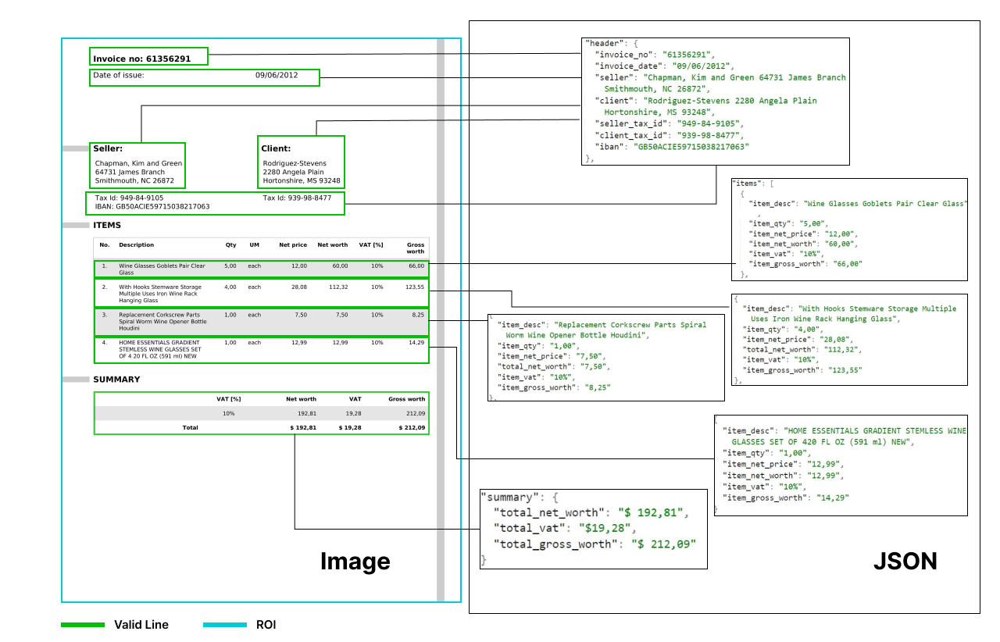
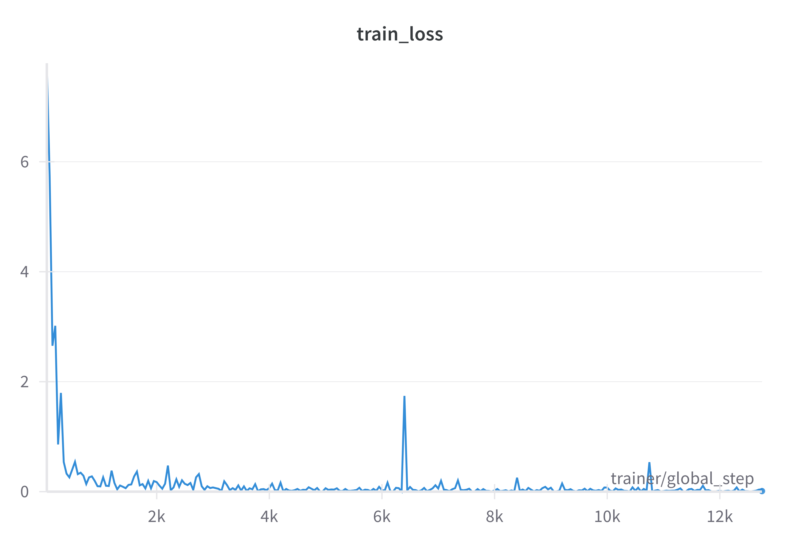
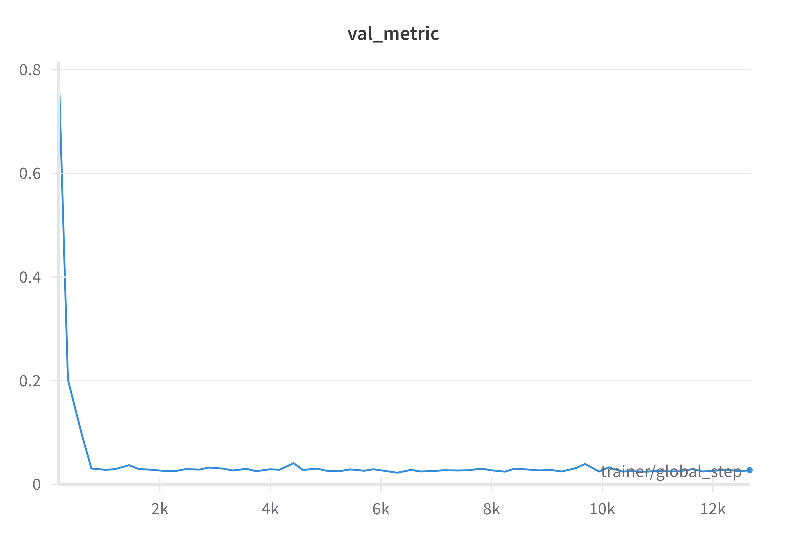
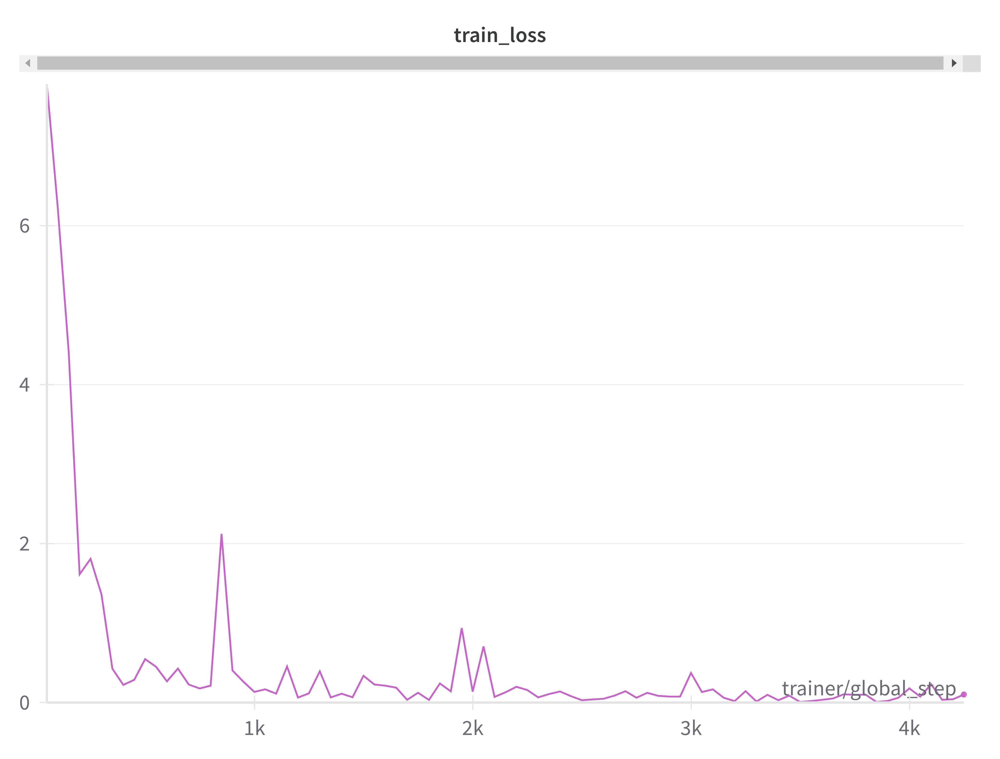
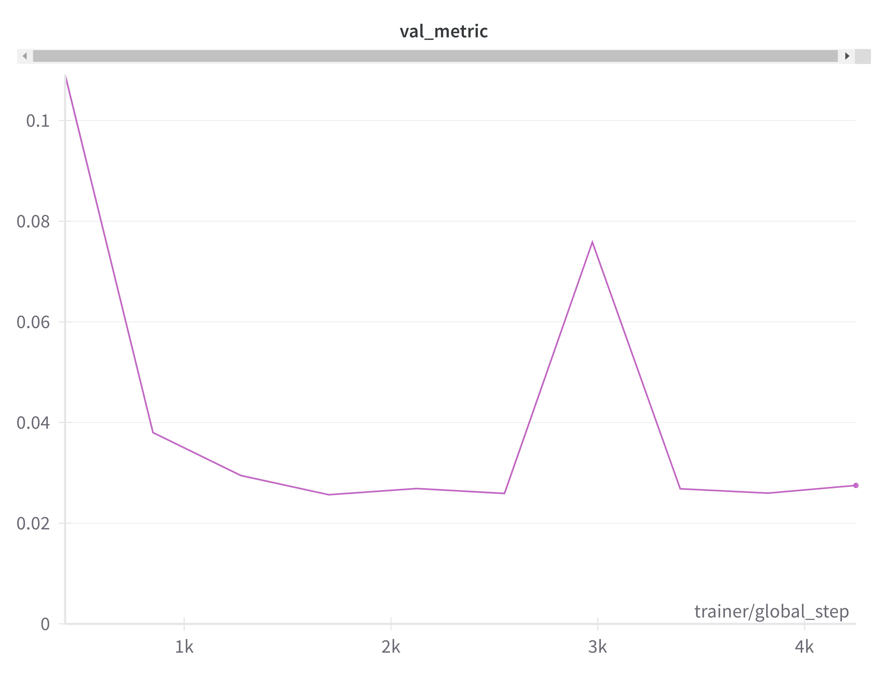

## Talk with you invoice.

**10 Epochs Model available at:**   [Huggingface 10 epochs 🤗](https://huggingface.co/Rajan/AIMT-invoices-donut_10Epochs)
**30 Epochs Model available at:**   [Huggingface 30 epochs 🤗](https://huggingface.co/Rajan/AIMT-invoices-donut_10Epochs)

**Dataset available at:** [Huggingface 🤗](https://huggingface.co/datasets/Rajan/AIMT-invoices-donut-data)

The dataset is in the format of [naver-clova-ix/cord-v2](https://huggingface.co/datasets/naver-clova-ix/cord-v2) dataset format. The dataset consists of invoices, which contains images and text annotations for OCR, and multi-level semantic labels for parsing. 

Dataset Source : [LINK](https://data.mendeley.com/datasets/tnj49gpmtz/2)

**Dataset Sample:**

**Validation metric:**

The validation metric used here is normalized edit distance. 
Normalized edit distance between two sequences $ \text{seq}_1 $ and $ \text{seq}_2 $ is calculated as:

$$ 
\text{Normalized Edit Distance} = \frac{D(\text{seq}_1, \text{seq}_2)}{\max(|\text{seq}_1|, |\text{seq}_2|)} 
$$

where:
- $ D(\text{seq}_1, \text{seq}_2) $ is the edit distance (Levenshtein distance) between the two sequences.
- $ |\text{seq}_1| $ and $ |\text{seq}_2| $ are the lengths of sequences $ \text{seq}_1 $ and $ \text{seq}_2 $ respectively.

The edit distance $ D(\text{seq}_1, \text{seq}_2) $ is the minimum number of single-character edits (insertions, deletions, or substitutions) required to transform $ \text{seq}_1 $ into $ \text{seq}_2 $.

**Train Loss for 30 Epochs:**

**Validation metric for 30 Epochs:**

**Train Loss for 10 Epochs:**

**Validation metric for 10 Epochs:**

